# Elite Dangerous Tools
### Description:

Python Discord bot and CLI utilities for route lookup, system inspection,
datasource import/export, and cache operations for Elite Dangerous GIS data.

## Elite Dangerous GIS
#### Description:

The Elite Dangerous game models the Milky Way in 3D space. This project
provides GIS-oriented tools backed by EDGIS plus local datasource caching.

https://www.spansh.co.uk/dumps

https://edgis.elitedangereuse.fr/

https://github.com/elitedangereuse/edgis

### Docker Image

An image of this deployed app is available on DockerHub:

https://hub.docker.com/repository/docker/fazleskhan/public-images/tags/elite-dangerous-discord-tools/

The image externalizes configuration, logs, and database storage to
`/config`, `/logs`, and `/data`.

### Starting

Run the Discord bot process via:

`python ./src/discord_runner.py`

Run the CLI entrypoint via:

`python ./src/main.py <command> [options]`

When loading Python dependencies for a development environment, install both:

`pip install -r requirements.txt`

`pip install -r dev-requirements.txt`

To enable repository spell checking with `cspell`, run:

`npm run spellcheck`

### Configuration

#### Environment Variables

* `DISCORD_TOKEN`: required Discord bot token for `discord_runner.py` and
  `EDDiscordBot.run()`
* `DATASOURCE_TYPE`: datasource backend (`tinydb` or `redis`), default `tinydb`
* `TINYDB_NAME`: TinyDB file path override (default `./data/ed_route.db`)
* `REDIS_URL`: required when `DATASOURCE_TYPE=redis`
* `REDIS_APP_NAME`: Redis key namespace prefix (default `eddt`)
* `REDIS_MAX_CONNECTIONS`: optional Redis connection pool size override

### Logging

* Logging uses Loguru via `src/ed_app_logging.py`.
* Runtime configuration is externalized in `config/loguru.json`.
* Config changes are hot-reloaded via watchdog file events.
* Default behavior writes datestamped file logs under `logs/`,
  archives/compresses old logs under `logs/archive`, and expires archived
  logs by retention rules.
* Console output is colorized and split by level (`info/warning` on stdout,
  `error` on stderr by default).

## Entrypoints

### CLI Entrypoint
Entrypoint: `python src/main.py <command> [options]`

Overview: Unified synchronous CLI for route search, system inspection,
cache inspection, distance checks, datasource initialization, and bulk cache
loading.

Commands and available arguments:

* `ping`
  * Overview: Health check command that returns `Pong`.
  * Arguments: none.
* `all_loaded_systems`
  * Overview: Lists all currently cached/loaded system names.
  * Arguments: none.
* `system_info`
  * Overview: Fetches and prints system info payload for a single system.
  * Arguments: `--system_name` (required).
* `path`
  * Overview: Computes a route between source and destination using BFS-based
    traversal and distance bounds.
  * Arguments: `--initial` (required), `--destination` (required),
    `--max_systems` (required, max `1000`), `--min_distance` (optional,
    default `0`), `--max_distance` (optional, default `10000`).
* `calc_systems_distance`
  * Overview: Computes Euclidean distance between two systems.
  * Arguments: `--initial` (required), `--destination` (required).
* `init_datasource`
  * Overview: Imports seed JSON records into the configured datasource.
  * Arguments: `--import_dir` (optional, default `default_init_dir`).
* `bulk_load_cache`
  * Overview: Performs breadth-first cache preloading from seed systems.
  * Arguments: `--initial_systems` (required, comma-separated seeds),
    `--max_nodes_visited` (required).

### Discord Process Entrypoint
Entrypoint: `python src/discord_runner.py`

Overview: Starts the standalone Discord bot process with environment/default
wiring via `EDDiscordBot.create()`.

Arguments and configuration:

* CLI arguments: none.
* Environment requirement: `DISCORD_TOKEN` must be configured.
* Command prefix: optional in composition; default `!`.

### Discord Command Entrypoints
Entrypoint surface: commands registered by `EDDiscordBot.register_commands()`.

Overview: Async command handlers that expose route lookup, system info,
distance, datasource init, and cache workflows in Discord.

Commands and available arguments:

* `!ping`
  * Overview: replies with latency (`Pong (<ms> ms)`).
  * Arguments: none.
* `!system_info <arg>`
  * Overview: fetches and sends the target system payload; long payloads are
    chunked.
  * Arguments: `arg` (required system name).
* `!path <initial_system_name> <destination_system_name> [max_system_count=100] [min_distance=0] [max_distance=10000]`
  * Overview: runs route search with progress updates and returns
    route/no-route result.
  * Arguments: first two required, remaining optional with ed_defaults shown.
* `!calc_systems_distance <system_name_one> <system_name_two>`
  * Overview: computes and reports distance between two systems.
  * Arguments: both required.
* `!dump_system_cache_names`
  * Overview: dumps cached system names in chunks and reports total count.
  * Arguments: none.
* `!init_datasource [import_dir=default_init_dir]`
  * Overview: initializes datasource from import directory.
  * Arguments: optional `import_dir`.
* `!bulk_load_cache <initial_systems> <max_nodes_visited>`
  * Overview: bulk loads cache from comma-separated seeds.
  * Arguments: both required.

### Data Transfer Utility Entrypoints

Overview: Focused import/export scripts for per-system JSON transfers between
filesystem and datasource backends.

* `python src/import_tinydb.py`
  * Overview: imports JSON files into TinyDB.
  * Arguments: `--import-dir` (optional, default `default_export_dir`).
* `python src/import_redis.py`
  * Overview: imports JSON files into Redis.
  * Arguments: `--import-dir` (optional, default `default_export_dir`).
* `python src/export_tinydb.py`
  * Overview: exports TinyDB records to per-system JSON files.
  * Arguments: `--export-dir` (optional, default `default_export_dir`).
* `python src/export_redis.py`
  * Overview: exports Redis records to per-system JSON files.
  * Arguments: `--export-dir` (optional, default `default_export_dir`).

## Code Overview

### `EDMain`

Source: `src/main.py`

CLI command compositor exposing route/cache operations.

Key methods:
* `__init__`: Store the route service and logger used by CLI commands.
* `create`: Build a fully wired CLI application object.
* `ping`: Return the CLI health-check response.
* `get_all_system_names`: Return every known system name from the route service.
* `calc_route`: Calculate a route synchronously for the CLI.
* `calc_systems_distance`: Return the distance between two systems through the route service.
* `get_system_info`: Return system payloads for the requested system names.
* `init_datasource`: Initialize the configured datasource from an import directory.
* `bulk_load_cache`: Preload cache entries starting from the supplied seed systems.

### `EDDiscordBot`

Source: `src/ed_discord_bot.py`

Inversion‑of‑control wrapper around a :class:`commands.Bot` instance.

Key methods:
* `__init__`: Store the bot, route service, token, and logger for Discord commands.
* `create`: Build a fully wired Discord bot from defaults and optional overrides.
* `on_ready`: Log that the Discord bot has connected and is ready.
* `ping`: Respond to the Discord health-check command.
* `system_info`: Send system metadata for one named system to Discord.
* `calc_systems_distance`: Report the distance between two systems in Discord.
* `path`: Calculate and report a route between two systems in Discord.
* `chunked_system_list`: Return a list-backed view of system names split into chunks.
* `dump_system_cache_names`: Send the cached system-name list to Discord in readable chunks.
* `init_datasource`: Initialize the datasource from Discord and report completion.
* `bulk_load_cache`: Bulk load cache entries from a Discord command.
* `run`: Start the bot using the configured token/logging.

### `EDRouteService`

Source: `src/ed_route.py`

Thin facade over delegate service classes.

Key methods:
* `__init__`: Store the composed route-layer collaborators.
* `init_datasource`: Initialize the datasource from the given directory.
* `get_system_info`: Return cached or fetched metadata for one system.
* `get_all_system_names`: Return every known system name.
* `bulk_load_cache`: Bulk load cache entries from the supplied seed systems.
* `path`: Calculate a route between two systems.
* `calc_systems_distance`: Compute the distance between two systems.

### `EDRouteServiceFactory`

Source: `src/ed_route_service_factory.py`

Build the application's default route-service object graph.

Key methods:
* `create`: Return an `EDRouteService` with defaults for any omitted collaborators.

### `InterceptHandler`

Source: `src/ed_app_logging.py`

Forward standard-library logging records into Loguru.

Key methods:
* `emit`: Convert one standard-library logging record into a Loguru log call.

### `_LoguruConfigWatcher`

Source: `src/ed_app_logging.py`

Watch the Loguru config file and reapply logging when it changes.

Key methods:
* `__init__`: Store config-file tracking state for future reload checks.
* `start`: Apply the initial config and start filesystem watching if enabled.
* `handle_fs_event`: React to a filesystem event that may affect the config file.

### `EDRedis`

Source: `src/ed_redis.py`

Redis-backed datasource for cached system records.

Key methods:
* `create`: Build a Redis datasource using defaults when options are omitted.
* `__init__`: Initialize Redis connection settings, locks, and shutdown behavior.
* `init_datasource`: Initialize the Redis datasource from a seed directory.
* `import_datasource`: Import per-system JSON files into Redis.
* `export_datasource`: Export all stored Redis systems into JSON files.
* `insert_system`: Persist one system payload through the synchronous Redis API.
* `get_system`: Return one stored system payload, shielding callers from backend errors.
* `add_neighbors`: Persist neighbor data for a stored system.
* `get_all_systems`: Return every stored system payload through the synchronous API.
* `close`: Mark the datasource closed so future Redis operations fail fast.

### `EDTinyDB`

Source: `src/ed_tinydb.py`

TinyDB-backed datasource for cached system records.

Key methods:
* `create`: Build a TinyDB datasource using defaults when no name is supplied.
* `__init__`: Initialize TinyDB paths, locks, and in-memory caches.
* `init_datasource`: Initialize the TinyDB datasource from a seed directory.
* `import_datasource`: Import per-system JSON files into TinyDB.
* `export_datasource`: Export all stored systems from TinyDB into JSON files.
* `insert_system`: Persist one system record and update local caches.
* `get_system`: Return one system payload, shielding callers from backend errors.
* `get_all_systems`: Return all stored systems through the synchronous datasource API.
* `add_neighbors`: Persist neighbor data for a system through the synchronous API.

### `EDGis`

Source: `src/ed_edgis.py`

OO gateway wrapper around EDGIS HTTP lookups.

Key methods:
* `__init__`: Store the logger used for EDGIS request tracing and failures.
* `fetch_system_info`: Fetch coordinate and metadata information for one system name.
* `fetch_neighbors`: Fetch neighboring systems around a coordinate triplet.

### `EDGisCache`

Source: `src/ed_edgis_cache.py`

Cache layer with injected fetchers for easier testing.

Key methods:
* `__init__`: Store the datasource and fetchers used for cache-through reads.
* `create`: Build a cache wrapper from explicit datasource and fetcher dependencies.
* `find_system_info`: Return system metadata from cache, fetching and persisting on misses.
* `find_system_neighbors`: Return cached neighbors for a system, populating them on demand.

### `EDBfsAlgo`

Source: `src/ed_bfs_algo.py`

OO wrapper for BFS traversal with IoC-friendly construction.

Key methods:
* `__init__`: Store the collaborators needed for breadth-first traversal.
* `travel`: Search for a route between systems using BFS with distance bounds.

### `EDBulkLoadAlgo`

Source: `src/ed_bulk_load_algo.py`

Bulk loader with injected cache functions for IoC-friendly composition.

Key methods:
* `__init__`: Store the cache-backed fetch functions used during bulk loading.
* `create`: Build a bulk loader from a cache object and shared logger.
* `load`: Preload cache data by walking outward from seed systems.

## Libraries

### Runtime Libraries

Install with: `pip install -r requirements.txt`

* `aiohttp`: HTTP client for EDGIS API requests in `src/ed_edgis.py`.
* `aiotinydb`: Async TinyDB helper dependency retained for TinyDB-related runtime compatibility.
* `autologging`: Lightweight tracing decorator used where available in runtime modules.
* `discord`: Discord bot framework used by `src/ed_discord_bot.py` and `src/discord_runner.py`.
* `loguru`: Primary logging library configured through `src/ed_app_logging.py`.
* `loguru-config`: Optional Loguru config loader used when reading external logging configuration.
* `psutil`: System metrics helper used for worker-count and connection-pool sizing.
* `python-dotenv`: Loads `.env` configuration for CLI, Discord, datasource, and logging setup.
* `redis[hiredis]`: Redis client with hiredis acceleration for the Redis datasource in `src/ed_redis.py`.
* `tinydb`: Local document database backing the TinyDB datasource in `src/ed_tinydb.py`.
* `tinydb-smartcache`: Smart-cache table implementation used by `SmartCacheTinyDB` in `src/ed_tinydb.py`.
* `ujson`: Fast JSON helper used by project dependencies and retained in the runtime image.
* `watchdog`: File watching library used for hot-reloading `config/loguru.json`.

### Development Libraries

Install with: `pip install -r dev-requirements.txt`

* `austin-python`: Sampling profiler used by local workload profiling and performance debugging.
* `black`: Code formatter used as the repository's canonical Python formatting pass.
* `coverage`: Coverage engine used underneath coverage reports and pytest coverage runs.
* `mypy`: Optional static type checker kept for development workflows that prefer mypy alongside pyright.
* `pyright`: Static type checker run against the repository as a required quality gate.
* `pytest`: Test runner used for the project's unit and integration-style test suite.
* `pytest-asyncio`: Async test support for Discord, logging, and sync/async bridge tests.
* `pytest-cov`: Pytest plugin used to collect test coverage metrics during development checks.
* `pyupgrade`: Modernizes Python syntax during post-change cleanup passes.
* `refurb`: Suggests more idiomatic Python refactors across the codebase.
* `ruff`: Primary lint tool used to catch style, correctness, and simplification issues.
* `tuna`: Browser-based profiler used during optional local performance inspection.

## Business Rules

Business behavior and user-visible rules are documented in [BUSINESS_SPEC.md](BUSINESS_SPEC.md).

Full project reconstruction guidance is documented across [BUSINESS_SPEC.md](BUSINESS_SPEC.md) and [INFRASTRUCTURE_SPEC.md](INFRASTRUCTURE_SPEC.md).

## Architecture Variations

Project-specific architecture additions and overrides are documented in [ARCHITECTURE.project.md](ARCHITECTURE.project.md).

## Scripts

### `generate_readme.py`

Assembles `README.md` from `docs/README_TEMPLATE.md` plus embedded `[README:...]` blocks
stored in repository source files and scripts.

Usage:
- `python scripts/generate_readme.py`

Arguments:
- This script takes no command-line arguments.

### `profile_workload.py`

Runs small performance profiling workloads against the route service so you can
measure datasource initialization, route generation, or repeated distance
calculations from the command line.

Usage:
- `python scripts/profile_workload.py init`
- `python scripts/profile_workload.py path --initial Sol --destination "Ross 248"`
- `python scripts/profile_workload.py distance_loop --iterations 5000`

Arguments:
- `mode`: Required positional argument. Choose one of `init`, `path`, or
  `distance_loop`.
- `--import_dir`: Path to the import data directory. Defaults to `./init`.
- `--db`: Temporary database path to use for the profiling run. Defaults to
  `/tmp/ed_profile.db`.
- `--initial`: Starting system name for `path` and `distance_loop`. Defaults to
  `Sol`.
- `--destination`: Destination system name for `path` and `distance_loop`.
  Defaults to `Ross 248`.
- `--max_systems`: Maximum number of systems to visit during `path`. Defaults to
  `1000`.
- `--min_distance`: Minimum jump distance filter for `path`. Defaults to `0`.
- `--max_distance`: Maximum jump distance filter for `path`. Defaults to `10000`.
- `--iterations`: Number of repeated calculations for `distance_loop`. Defaults
  to `1000`.

### `build_and_push.sh`

Builds the Docker image for this repository, tags it for the selected deployment
environment, tags the same image as `latest`, and pushes both tags to the configured
registry namespace.

Usage:
- `bash scripts/build_and_push.sh`
- `bash scripts/build_and_push.sh -e dev`
- `bash scripts/build_and_push.sh docker_env test`
- `DOCKER_ENV=dev bash scripts/build_and_push.sh`
- `DOCKER_ENV=test bash scripts/build_and_push.sh`
- `DOCKER_ENV=prod bash scripts/build_and_push.sh`

Arguments:
- `docker_env <value>`: Optional command-line override for the deployment
  environment. Supported values are `dev`, `test`, and `prod`.
- `-e <value>`: Short form of the same deployment-environment override.

Environment variables:
- `DOCKER_ENV`: Selects the image tag to build and push. Supported values are
  `dev`, `test`, and `prod`. The command-line override wins when both are
  provided. If neither is set, the script defaults to `dev`.

### `postCreateCommand.sh`

Prepares a development container or workstation by refreshing the Yarn apt key,
updating system packages, installing `austin`, and installing both runtime and
development Python dependencies for the project.

Usage:
- `bash scripts/postCreateCommand.sh`

Arguments:
- This script takes no positional command-line arguments.

Environment variables:
- This script does not currently read any custom environment variables.

## Diagrams

### Class Diagram

Source: [docs/diagrams/class_structure.puml](docs/diagrams/class_structure.puml)

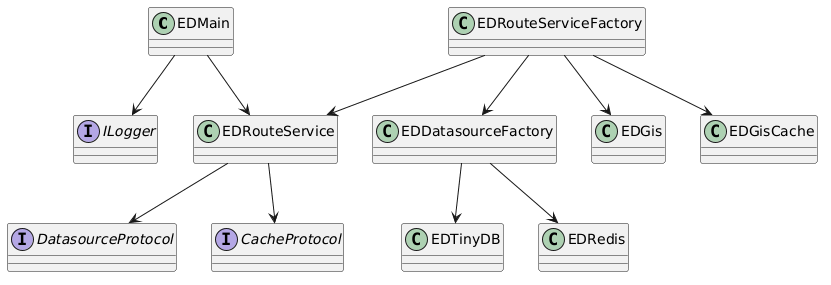

### Discord Bot Sequence Diagrams

#### `run`
Source: [docs/diagrams/discord/discord_run_flow.puml](docs/diagrams/discord/discord_run_flow.puml)

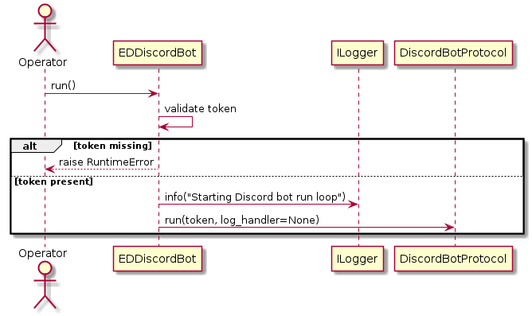

#### `on_ready`
Source: [docs/diagrams/discord/discord_on_ready_flow.puml](docs/diagrams/discord/discord_on_ready_flow.puml)

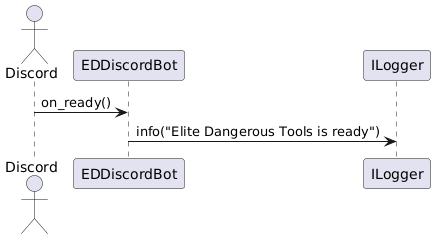

#### `ping`
Source: [docs/diagrams/discord/discord_ping_flow.puml](docs/diagrams/discord/discord_ping_flow.puml)

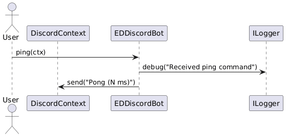

#### `system_info`
Source: [docs/diagrams/discord/discord_system_info_flow.puml](docs/diagrams/discord/discord_system_info_flow.puml)

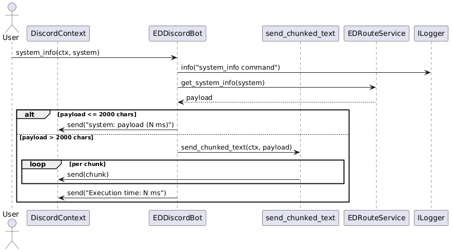

#### `path`
Source: [docs/diagrams/discord/discord_path_flow.puml](docs/diagrams/discord/discord_path_flow.puml)

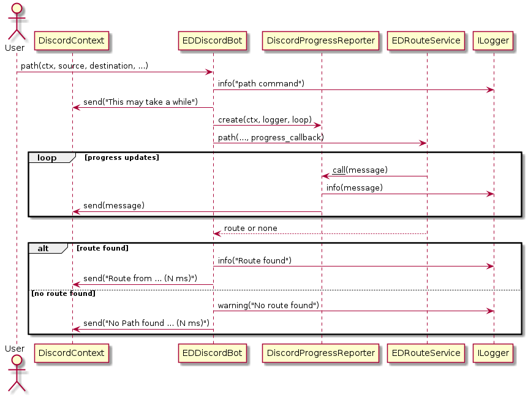

#### `calc_systems_distance`
Source: [docs/diagrams/discord/discord_calc_systems_distance_flow.puml](docs/diagrams/discord/discord_calc_systems_distance_flow.puml)

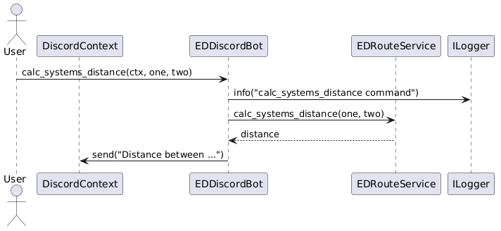

#### `dump_system_cache_names`
Source: [docs/diagrams/discord/discord_dump_system_cache_names_flow.puml](docs/diagrams/discord/discord_dump_system_cache_names_flow.puml)

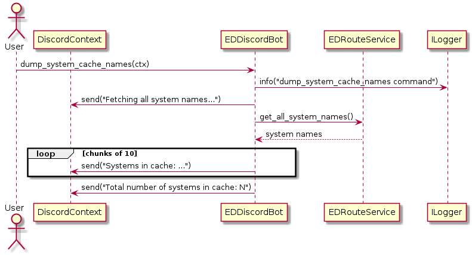

#### `init_datasource`
Source: [docs/diagrams/discord/discord_init_datasource_flow.puml](docs/diagrams/discord/discord_init_datasource_flow.puml)

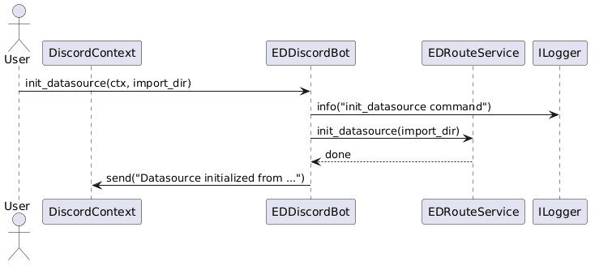

#### `bulk_load_cache`
Source: [docs/diagrams/discord/discord_bulk_load_cache_flow.puml](docs/diagrams/discord/discord_bulk_load_cache_flow.puml)

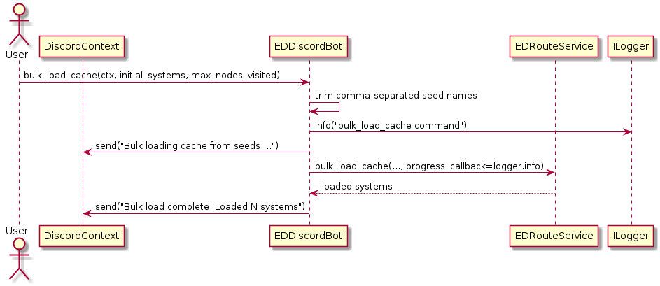

## Command Line Sequence Diagrams

#### `ping`
Source: [docs/diagrams/cli/cli_ping_flow.puml](docs/diagrams/cli/cli_ping_flow.puml)

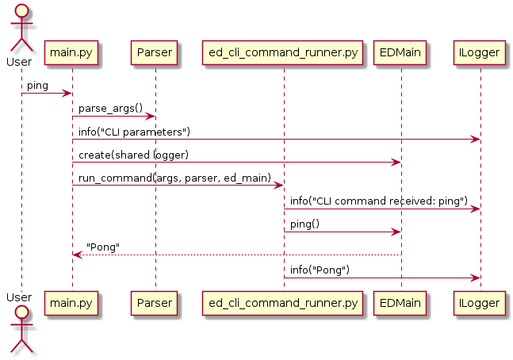

#### `all_loaded_systems`
Source: [docs/diagrams/cli/cli_all_loaded_systems_flow.puml](docs/diagrams/cli/cli_all_loaded_systems_flow.puml)

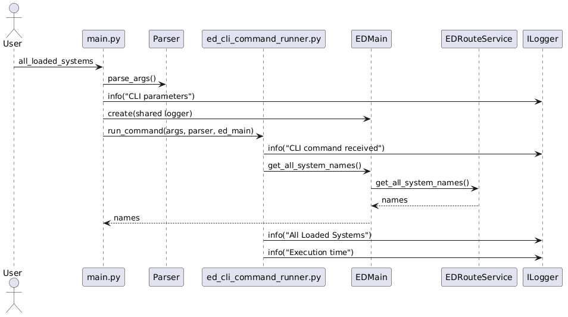

#### `system_info`
Source: [docs/diagrams/cli/cli_system_info_flow.puml](docs/diagrams/cli/cli_system_info_flow.puml)

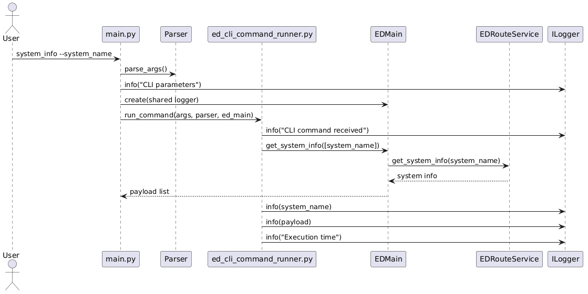

#### `path`
Source: [docs/diagrams/cli/cli_path_flow.puml](docs/diagrams/cli/cli_path_flow.puml)

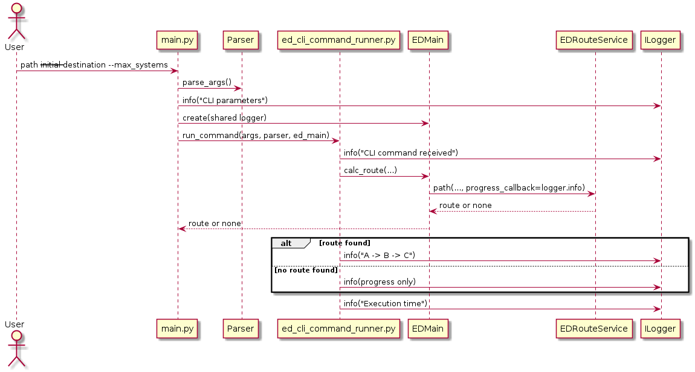

#### `calc_systems_distance`
Source: [docs/diagrams/cli/cli_calc_systems_distance_flow.puml](docs/diagrams/cli/cli_calc_systems_distance_flow.puml)

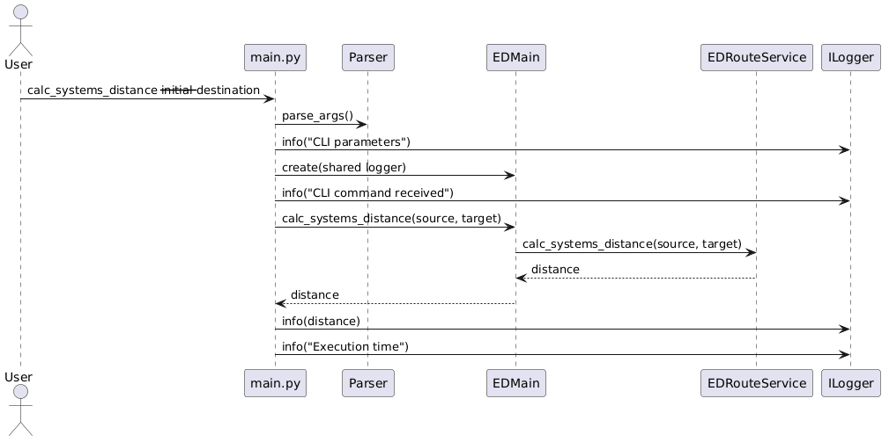

#### `init_datasource`
Source: [docs/diagrams/cli/cli_init_datasource_flow.puml](docs/diagrams/cli/cli_init_datasource_flow.puml)

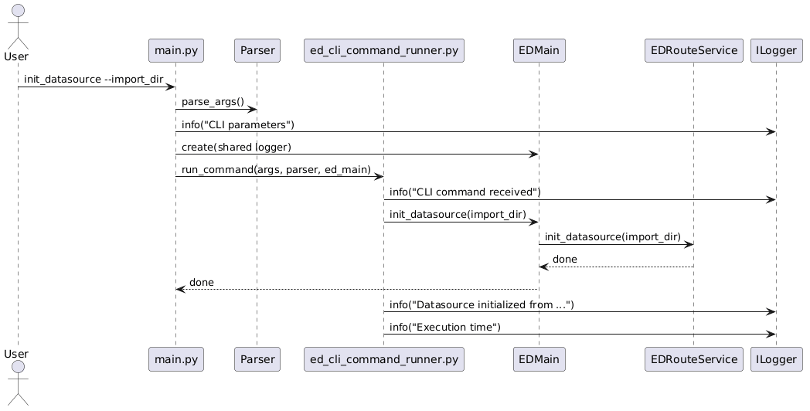

#### `bulk_load_cache`
Source: [docs/diagrams/cli/cli_bulk_load_cache_flow.puml](docs/diagrams/cli/cli_bulk_load_cache_flow.puml)

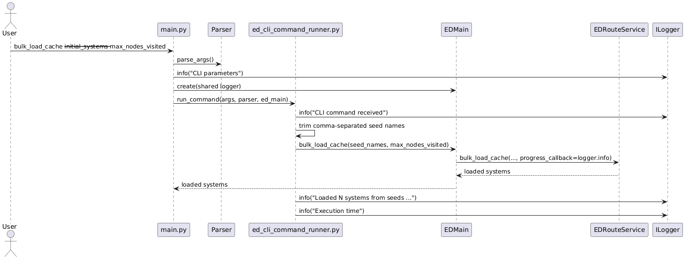

#### Handled CLI Error
Source: [docs/diagrams/cli/cli_handled_error_flow.puml](docs/diagrams/cli/cli_handled_error_flow.puml)

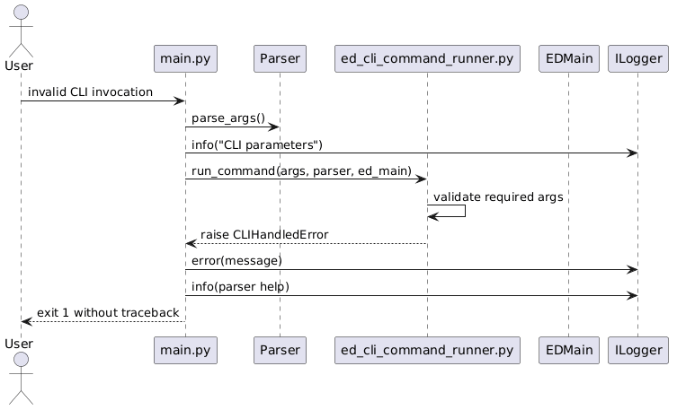
