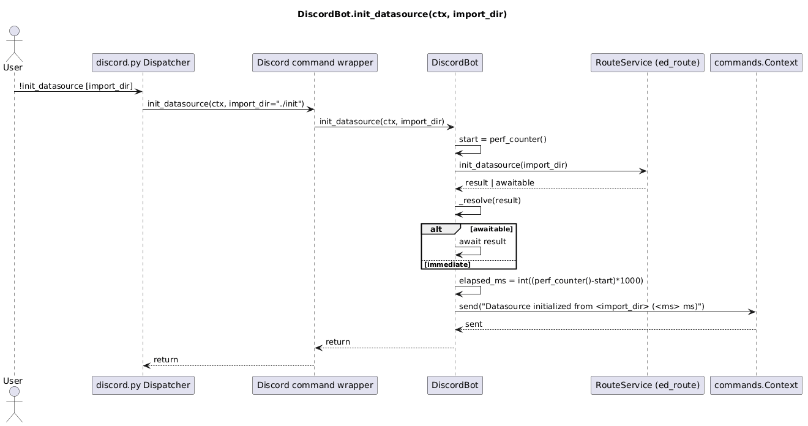

# Elite Dangerous Tools
### Description:

Python Discord bot providing utilities to work with the Elite Dangerous video game.

## Elite Dangerous GIS
#### Description:

The video game Elite Dangerous attempts to model the Milky Way in three-dimensional space. This tool provides utilities to work within its GIS. The project leverages data generated by the Neutron Planner website and a query API provided by the Elite Dangerous Galactic Information System (EDGIS).

https://www.spansh.co.uk/dumps

https://edgis.elitedangereuse.fr/

https://github.com/elitedangereuse/edgis

### Docker Image

An image of this deployed app is available on DockerHub

https://hub.docker.com/repository/docker/fazleskhan/public-images/tags/elite-dangerous-discord-tools/

The image externalizes the configuration, logs, and the database to /config, /logs, and /data

### Starting 

The Discord bot can be started by running the discord_runner.py script. For example, _python ./src/discord_bot.py_

### Configuration

#### Environment Variables

* DISCORD_TOKEN: Discord key used to identify and authorize the bot

### Logging

* Logging is powered by loguru.
* Runtime config is externalized in config/loguru.json.
* Config changes are hot-reloaded (no restart required) via watchdog file events.
* File logs rotate daily at midnight, compressed archives are stored in logs/archive, and logs older than 14 days are removed.
* Console logs are colorized.

### Discord Commands

* !ping
* !calc_systems_distance <system_one> <system_two>
* !system_info <system name> - for example !system_info Sol
* !path <initial system name> <destination system name> <max systems> <min distance> <max distance> - for example _!path Sol Sirius 1000 6 11_
* !dump_system_cache_names - for example _!dump_system_cache_names_
* !init_datasource - load system json file from the init directory into the datasource

#### ping

Simple ping-pong command to confirm connectivity

#### system_info

Returns information regarding the provided system name. If the system is not present in the local cache, the information is queried from EDGIS and cached.

#### calc_systems_distance

Calculates the distance between two systems given their coordinates in 3D space

#### path

Performs a breath-first-search from the source system to the destination system. If the current system does not exist, the data is queried from EDGIS. If the system neighbor is not present in the cache, it is queried from EDGIS. The graph search is pruned in two ways.

#### Directionality

While checking each node, the system calculates the total distance to the target based on its position in 3D space. If that distance is 5% greater than the smallest distance to the destination, the node is discarded. The 5% threshold is to permit the search to navigate around holes in the spatial data.

#### Max Distance

Unlike in normal graphs, every node (system) in EDGIS is reachable from every other node. The limiting factor is the distance any ship can travel. The optional parameter configures the value.

#### Min Distance

It is not to the traveler's benefit to visit every local system because every system (node) is visitable from every other system. So, this configuration limits the search for adjacent neighbors.

#### dump_system_cache_names

Iteratively displays all the names currently cached locally.

#### init_datasource

Iteratively loads the json contents of the init directory into the current datasource

### Diagrams

## Command line

The tool also provides a command line interaction. To run the command line run main.py

### Example Use

#### Command Line Help

Provide description of the commands and available options

__python ./src/main.py -h__

#### System Info

Returns information about the target system. It will retrieve information from EDGIS if not preset.

system_info <system_name>

for example __python ./src/main.py system_info Sol__

#### Calculate System Distances

Returns the distance between two system in 3D space

calc_systems_distance <system_one> <system_two>

for example __python ./src/main.py calc_systems_distance Sol Sirius__

#### Path

Calculates the path between two systems. 

main.py path <initial system> <destination system> <optional max nodes> <min distance> <max distance>

for example __python ./src/main.py path Sol Sirius 1000 6 11__

#### Init Datasource

main.py init_datasource 

