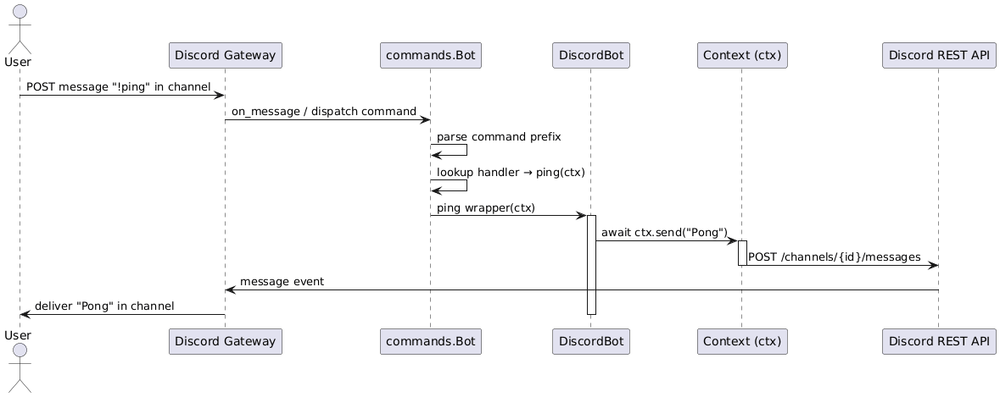
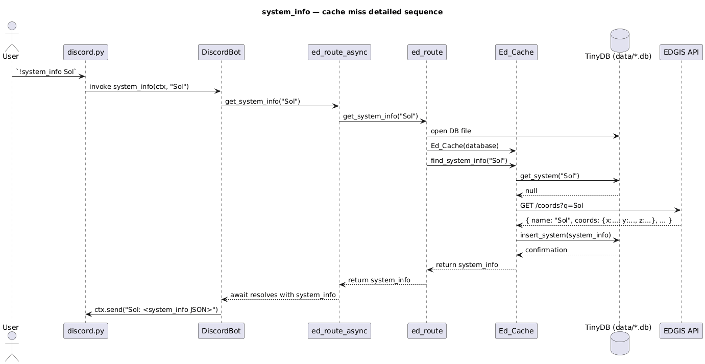
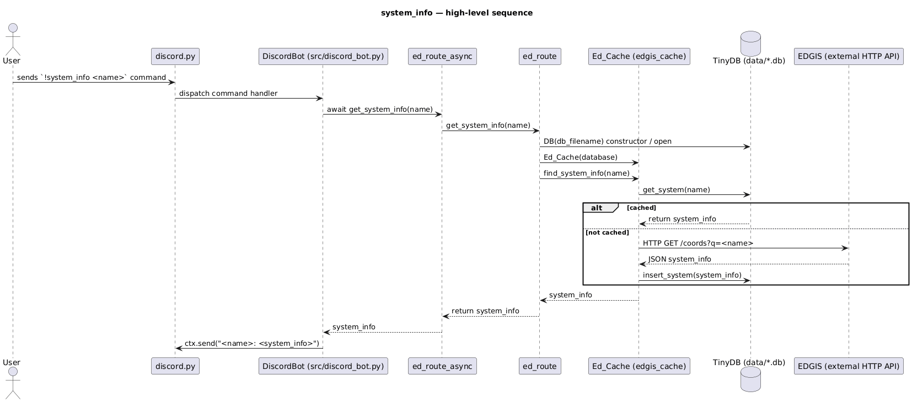
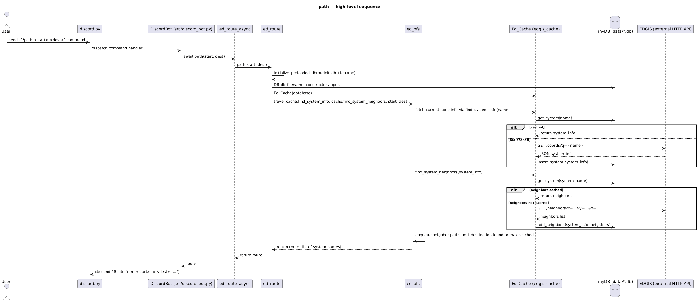
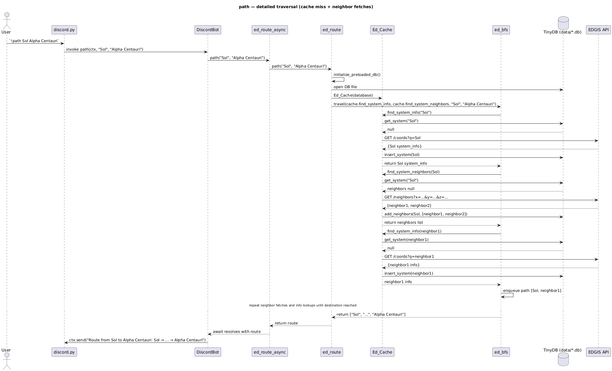
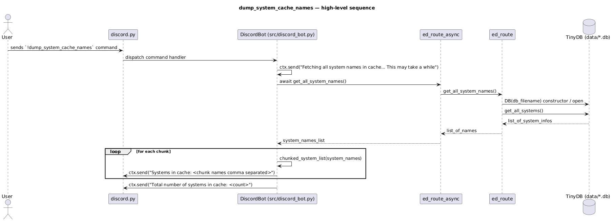
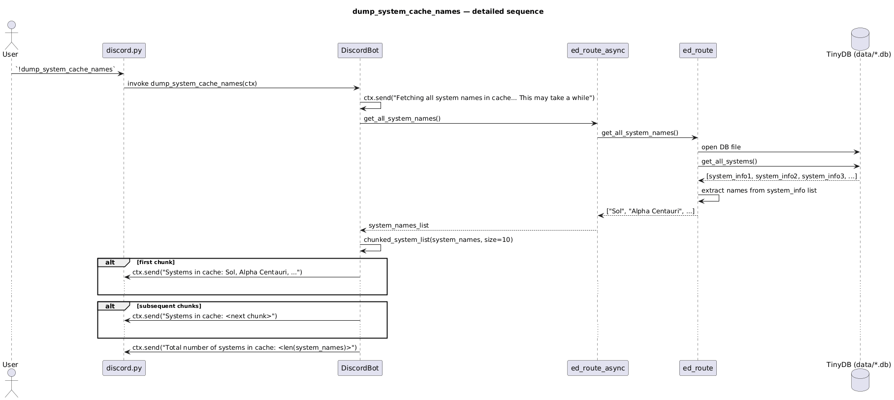

# Elite Dangerous Tools
### Description:

Python Discord bot enabling utilities to work with the Elite Dangerous video game.
## Elite Dangerous GIS
#### Description:

The video game Elite Dangerous attempts to model the Milky Way in three-dimensional space. This tool provides utilities to work with its GIS.
The project leverages data generated by the Neutron Planner website and a query API provided by the Elite Dangerous Galactic Information System (EDGIS).

https://www.spansh.co.uk/dumps

https://edgis.elitedangereuse.fr/

https://github.com/elitedangereuse/edgis

Discord Commands

* !ping
* !system_info `<system name>` - _for example !system_info Sol_
* !path `<initial system name>` `<destination system name>` - _for example !path Sol  Sirius_
* !dump_system_cache_names - _for example !dump_system_cache_names_

#### ping 
Simple ping-pong command to confirm connectivity
#### system_info
Returns information regarding the provided system name. If the system is not present in the local cache, the information is queried and cached from EDGIS
#### path
Performs a breath-first-search from the source system to the destination system. If the current system does not exist, the data is queried from EDGIS. If the system neighbor is not present in the cache, it is queried from EDGIS. The search will only visit a max 100 nodes
#### dump_system_cache_names
Iteratively displays all the names currently cached locally
### Diagrams

