# Elite Dangerous Tools
### Description:

Python Discord bot providing utilities to work with the Elite Dangerous video game.

## Elite Dangerous GIS
#### Description:

The video game Elite Dangerous attempts to model the Milky Way in three-dimensional space. This tool provides utilities to work within its GIS. The project leverages data generated by the Neutron Planner website and a query API provided by the Elite Dangerous Galactic Information System (EDGIS).

https://www.spansh.co.uk/dumps

https://edgis.elitedangereuse.fr/

https://github.com/elitedangereuse/edgis

### Docker Image

An image of this deployed app is available on DockerHub

https://hub.docker.com/repository/docker/fazleskhan/public-images/tags/elite-dangerous-discord-tools/

The image externalizes the configuration, logs, and the database to /config, /logs, and /data

### Starting

Run the Discord bot process via the runner script:

`python ./src/discord_runner.py`

### Configuration

#### Environment Variables

* `DISCORD_TOKEN`: Discord key used to identify and authorize the bot
* `DATASOURCE_TYPE`: datasource backend (`tinydb` or `redis`), default is `tinydb`
* `TINYDB_NAME`: TinyDB file path override (default `./data/ed_route.db`)
* `REDIS_URL`: required when `DATASOURCE_TYPE=redis`
* `REDIS_APP_NAME`: Redis key namespace prefix (default `eddt`)
* `REDIS_MAX_CONNECTIONS`: optional Redis connection pool size override

### Logging

* Logging is powered by loguru.
* Runtime config is externalized in config/loguru.json.
* Config changes are hot-reloaded (no restart required) via watchdog file events.
* File logs rotate daily at midnight, compressed archives are stored in logs/archive, and logs older than 14 days are removed.
* Console logs are colorized.

### Discord Commands

* `!ping`
* `!system_info <system_name>` (example: `!system_info Sol`)
* `!calc_systems_distance <system_one> <system_two>`
* `!path <initial_system_name> <destination_system_name> [max_system_count=100] [min_distance=0] [max_distance=10000]`
* `!dump_system_cache_names`
* `!init_datasource [import_dir=./init]`

#### Ping

Simple ping-pong command to confirm connectivity

#### System_Info

Returns information regarding the provided system name.

#### Calc_Systems_Distance

Calculates the distance between two systems given their coordinates in 3D space

#### Path

Performs a breadth-first-search from the source system to the destination system.

#### Directionality

While checking each node, the system calculates the total distance to the target based on its position in 3D space. If that distance is 5% greater than the smallest distance to the destination, the node is discarded. The 5% threshold is to permit the search to navigate around holes in the spatial data.

#### Max Distance

Unlike in normal graphs, every node (system) in EDGIS is reachable from every other node. The limiting factor is the distance any ship can travel. The optional parameter configures the value.

#### Minimum Distance

It is not to the traveler's benefit to visit every local system because every system (node) is visitable from every other system. So, this configuration limits the search for adjacent neighbors.

#### Dump_System_Cache_Names

Iteratively displays all the names currently cached locally.

#### Init_Datasource

Loads JSON files from the target import directory into the configured datasource.

### Discord Bot Sequence Diagrams

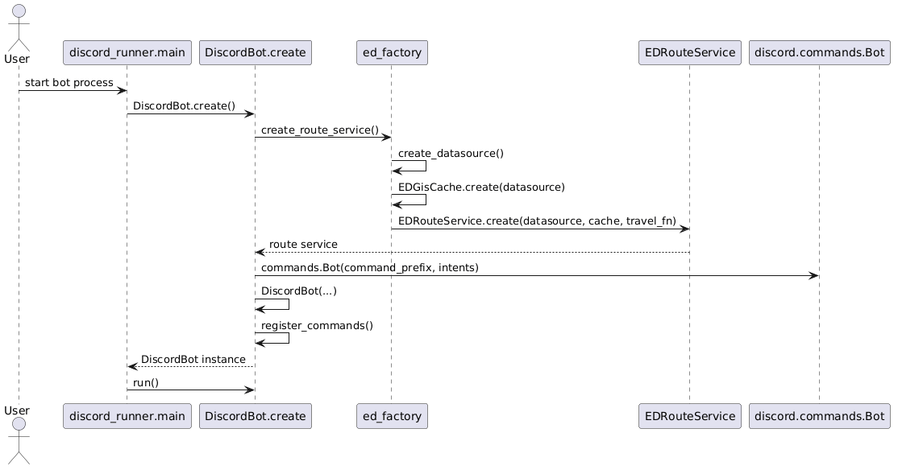

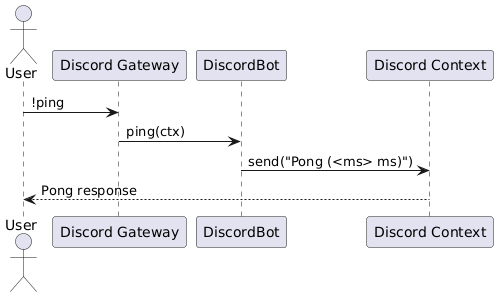

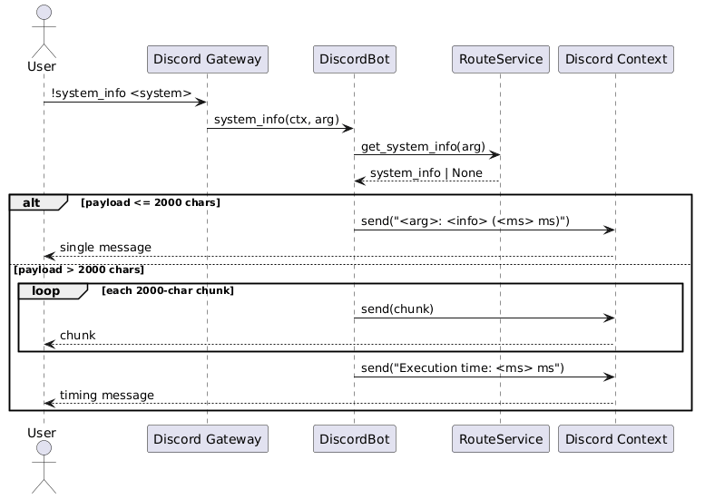

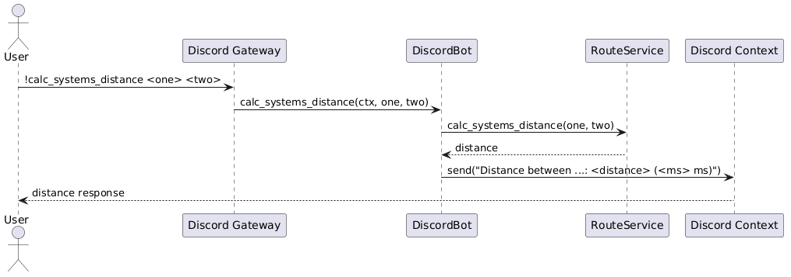

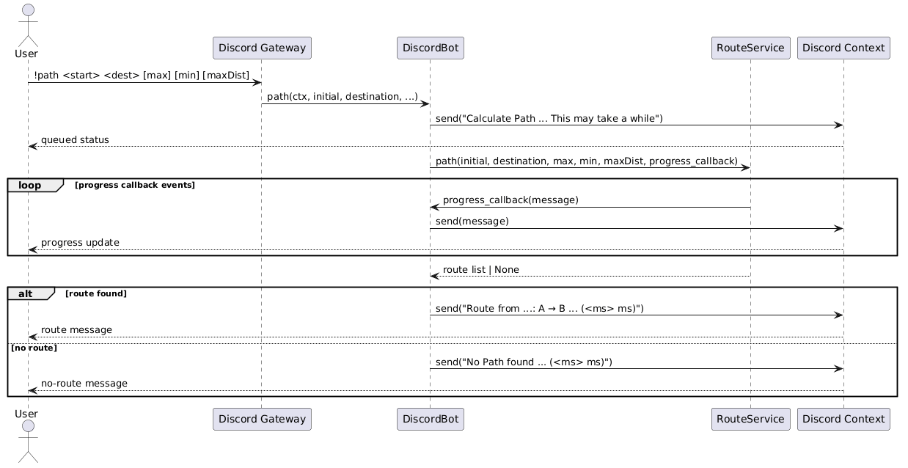

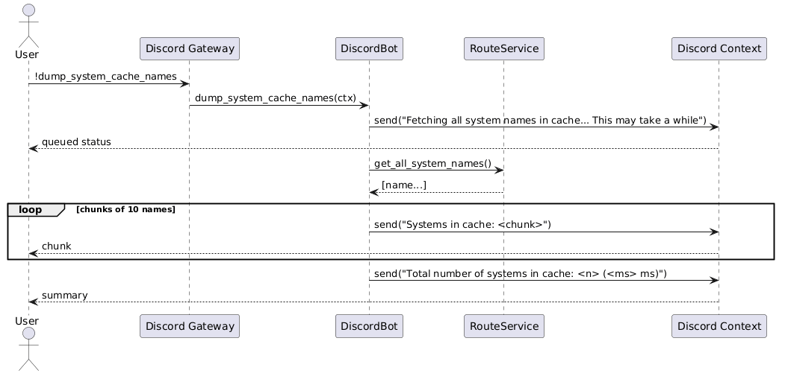

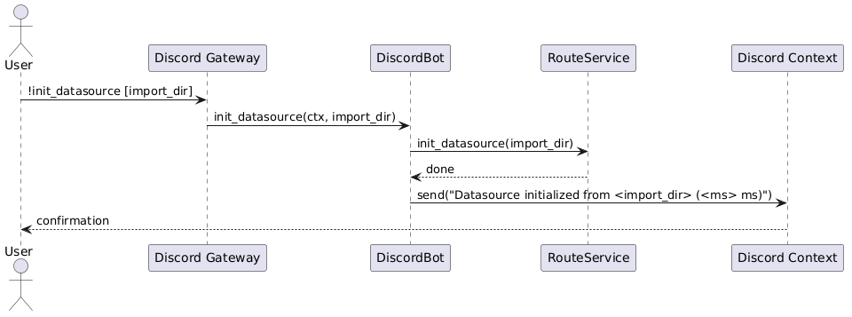

## Command Line

The tool also provides a CLI entrypoint:

`python ./src/main.py <command> [options]`

Supported commands:

* `all_loaded_systems`
* `system_info --system_name <name>`
* `path --initial <system> --destination <system> --max_systems <n> [--min_distance <n>] [--max_distance <n>]`
* `calc_systems_distance --initial <system> --destination <system>`
* `init_datasource [--import_dir <dir>]`

### Example Usage

#### Command Line Help

Provide description of the commands and available options

`python ./src/main.py -h`

#### System Info

Returns information about the target system. It will retrieve information from EDGIS if not preset.

`python ./src/main.py system_info --system_name Sol`

#### Calculate System Distances

Returns the distance between two system in 3D space

`python ./src/main.py calc_systems_distance --initial Sol --destination Sirius`

#### Path

Calculates the path between two systems. 

`python ./src/main.py path --initial Sol --destination Sirius --max_systems 1000 --min_distance 6 --max_distance 11`

#### Init Datasource

`python ./src/main.py init_datasource --import_dir ./init`

## Main Sequence Diagrams

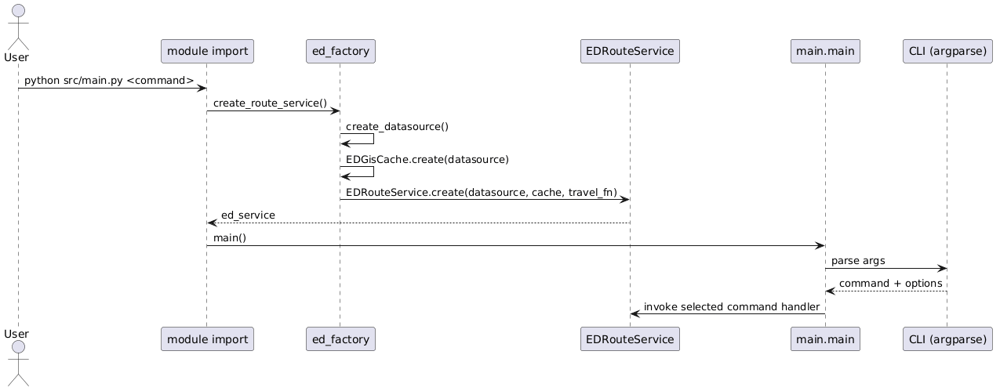

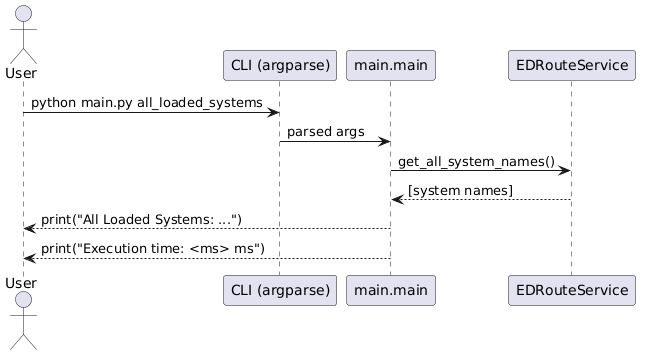

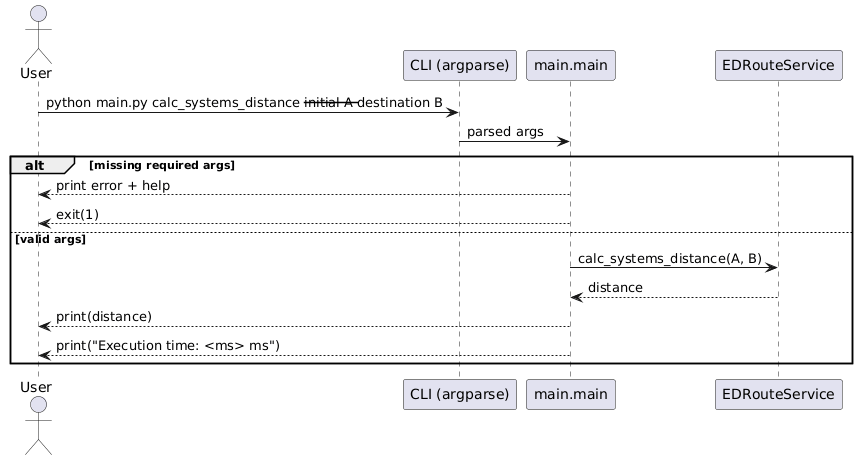

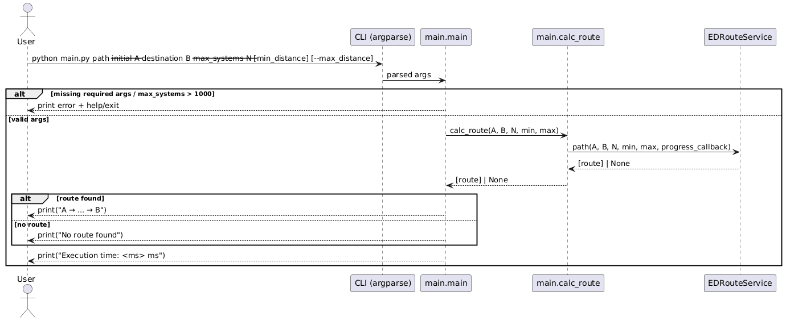

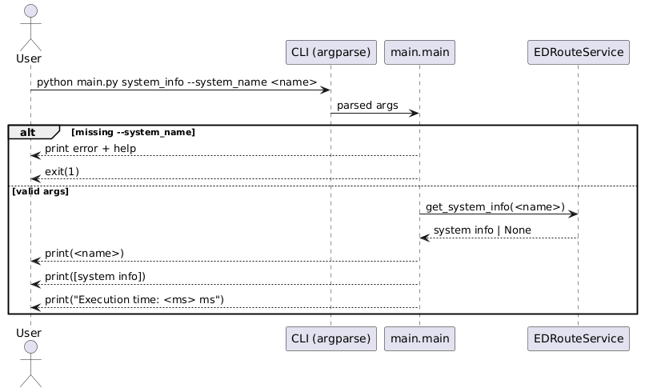

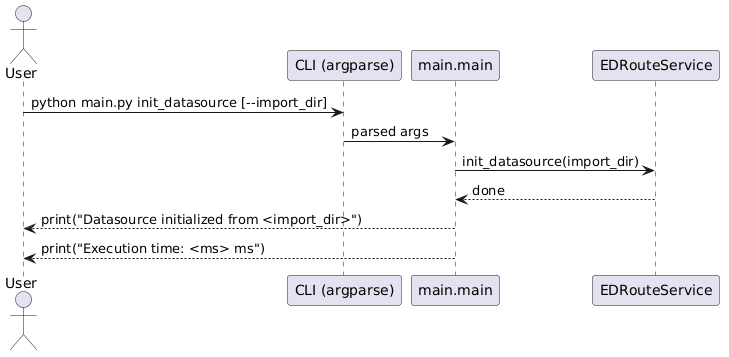

## Data Transfer Utils

### Export Redis

Extracts Redis records into one JSON file per system.

`python ./src/export_redis.py [--export-dir ./data/ed_redis-export]`

### Export TinyDB

Extracts TinyDB records into one JSON file per system.

`python ./src/export_tinydb.py [--export-dir ./data/ed_tinydb-export]`

### Import Redis

Imports JSON system files into Redis.

`python ./src/import_redis.py [--import-dir ./data/ed_tinydb-export]`

### Import TinyDB

Imports JSON system files into TinyDB.

`python ./src/import_tinydb.py [--import-dir ./data/ed_redis-export]`

## Data Transfer Utils Sequence Diagrams
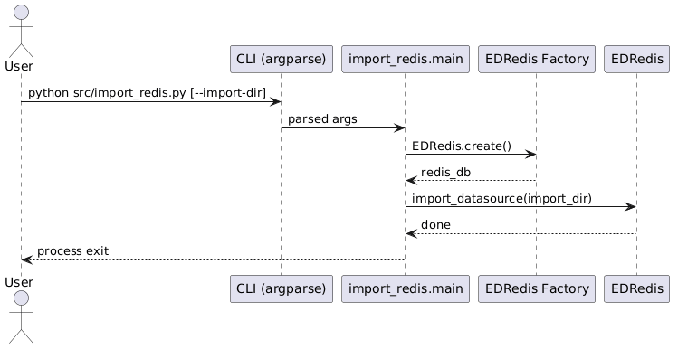

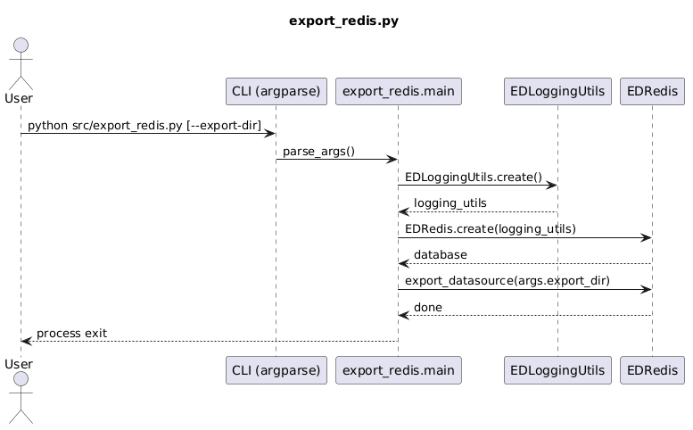

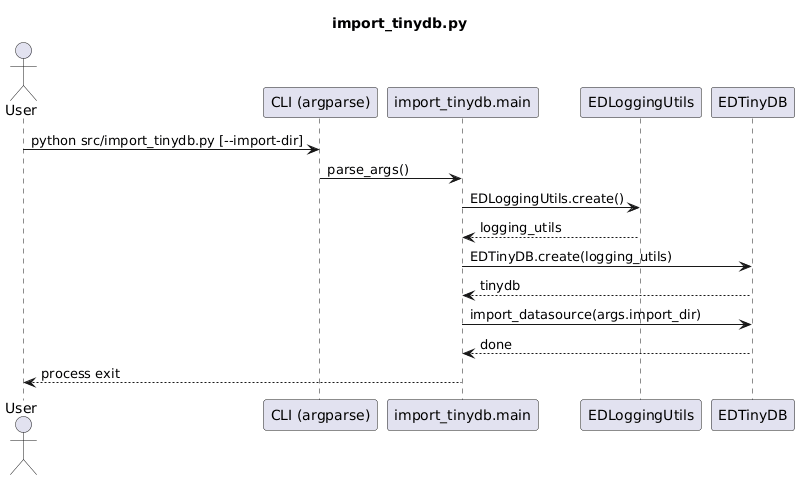

